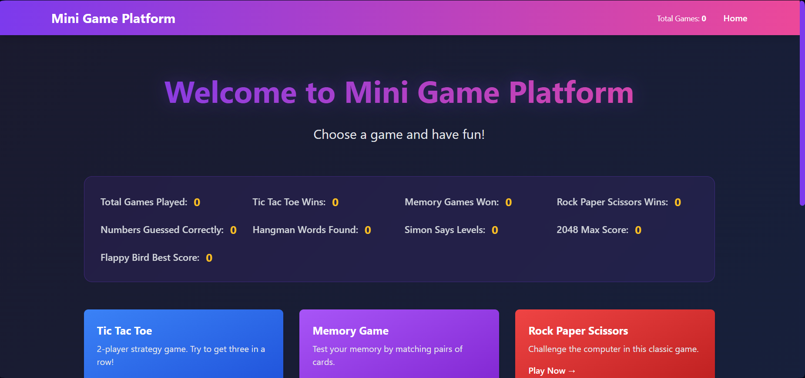
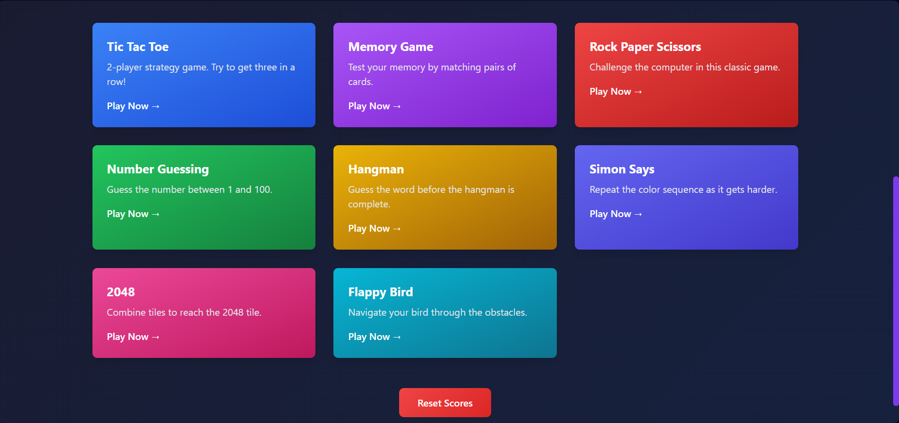
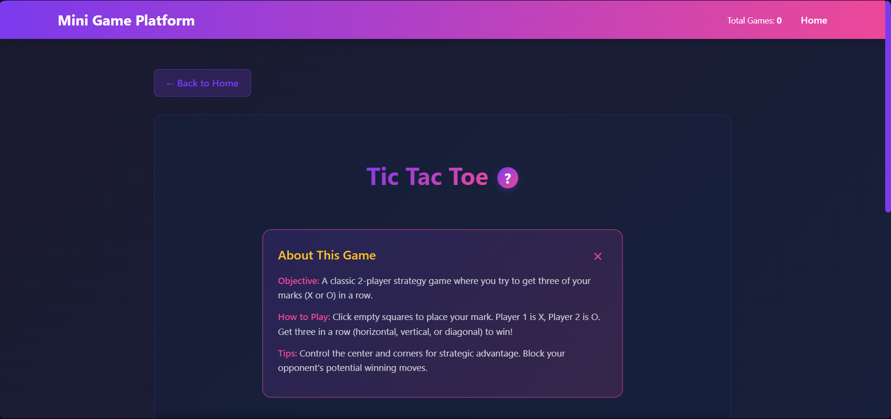
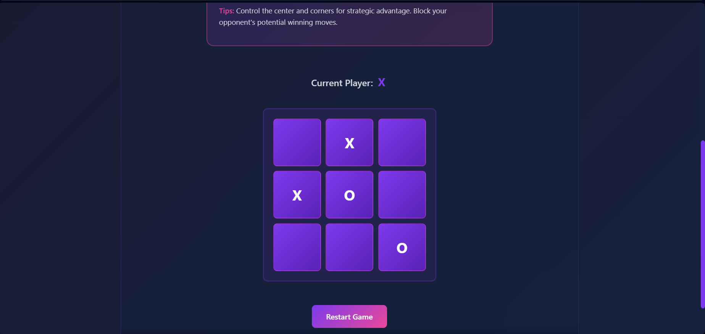
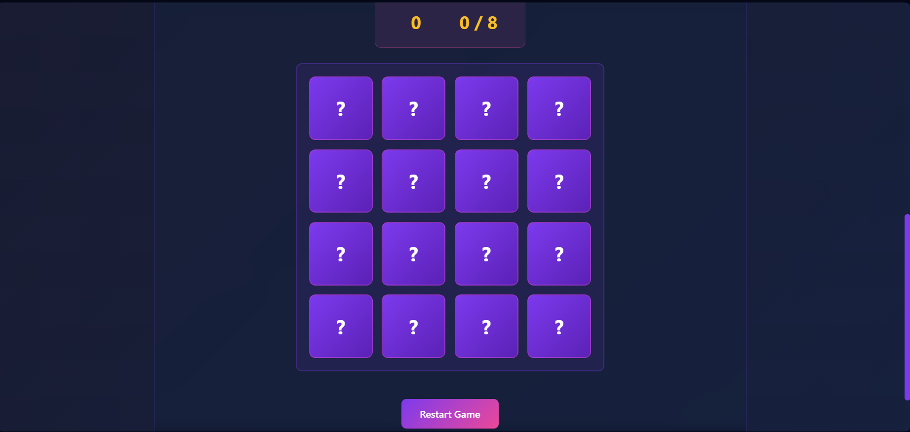
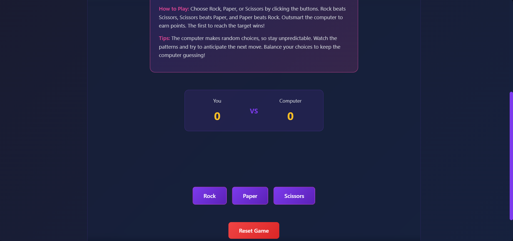
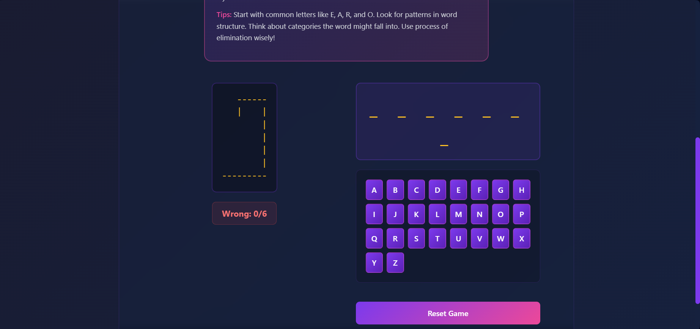
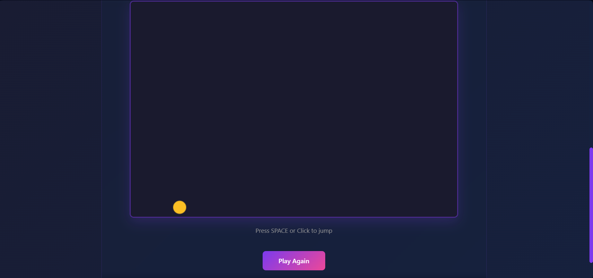

# Mini Game Platform

Mini Game Platform is a modern web application featuring a collection of classic games including Tic Tac Toe, Memory Game, Flappy Bird, 2048, Hangman, Number Guessing Game, Rock Paper Scissors, and Simon Says. Built with React.js, it offers smooth animations, responsive design, and score tracking to provide an engaging gaming experience.










## Games Included

- **Tic Tac Toe**: Classic 2-player strategy game with winner detection and board highlighting
- **Memory Game**: Test your memory by matching pairs of cards
- **Flappy Bird**: Navigate through obstacles in this addictive endless game
- **2048**: Merge numbered tiles to reach the 2048 tile and discover higher scores
- **Hangman**: Guess the word before running out of attempts
- **Number Guessing Game**: Try to guess the random number within a limited range
- **Rock Paper Scissors**: Play the classic game against the computer
- **Simon Says**: Repeat the sequence of colored lights to progress through levels

## Features

- Smooth animations with Framer Motion
- Modern dark theme with gradient UI
- Fully responsive design
- Score tracking with localStorage persistence
- Built with React Router for navigation
- Context API for state management
- Tailwind CSS + custom CSS
- Reusable functional components

## Prerequisites

- Node.js (v14 or higher)
- npm (v6 or higher)

## Installation & Setup

### Step 1: Install Dependencies
```bash
npm install
```

This will install all required packages:
- react (v18.2.0)
- react-dom (v18.2.0)
- react-router-dom (v6.20.0)
- framer-motion (v10.16.16)
- tailwindcss (v3.4.1)
- react-scripts (v5.0.1)

### Step 2: Start the Development Server
```bash
npm start
```

The application will open automatically in your browser at `http://localhost:3000`

## Project Structure

```
mini-game-platform/
├── public/
│   └── index.html
├── src/
│   ├── assets/
│   ├── components/
│   │   ├── Navbar.js
│   │   ├── GameCard.js
│   │   ├── Loader.js
│   │   └── ScrollToTop.js
│   ├── games/
│   │   ├── TicTacToe/
│   │   │   ├── TicTacToe.js
│   │   │   └── TicTacToe.css
│   │   ├── MemoryGame/
│   │   │   ├── MemoryGame.js
│   │   │   └── MemoryGame.css
│   ├── pages/
│   │   ├── Home/
│   │   │   ├── Home.js
│   │   │   └── Home.css
│   │   ├── GamePage/
│   │   │   ├── GamePage.js
│   │   │   └── GamePage.css
│   ├── context/
│   │   └── ScoreContext.js
│   ├── hooks/
│   │   └── useLocalStorage.js
│   ├── styles/
│   │   └── global.css
│   ├── App.js
│   ├── App.css
│   └── index.js
├── .env
├── .gitignore
├── package.json
├── tailwind.config.js
└── README.md
```

## How to Play

### Tic Tac Toe
1. Navigate to the Tic Tac Toe game from the home page
2. Player X goes first
3. Click on any empty cell to place your mark
4. First player to get three in a row wins
5. Winning cells will be highlighted in gold
6. Click "Restart Game" to play again

### Memory Game
1. Navigate to the Memory Game from the home page
2. Click on cards to reveal letters (A-H)
3. Try to match pairs of identical letters
4. The game tracks your moves
5. Win by matching all pairs in the fewest moves possible
Design Features

- **Dark Theme**: Purple and pink gradient primary colors
- **Responsive**: Works seamlessly on desktop, tablet, and mobile
- **Smooth Animations**: Framer Motion transitions for cards, buttons, and game states
- **Score Tracking**: Persistent stats using localStorage
- **Modern UI**: Tailwind CSS for rapid, consistent styling

##
## 🔧 Available Scripts

```bash
# Start development server
npm start

# Build for production
npm build

# Run tests
npm test

# Eject configuration (one-way operation)
npm eject
```
Tech Stack

- **React** 18.2.0 - UI Library
- **React Router DOM** 6.20.0 - Client-side routing
- **Framer Motion** 10.16.16 - Animation library
- **Tailwind CSS** 3.4.1 - Utility-first CSS
- **React Scripts** 5.0.1 - Create React App scripts

##
## 🌐 Browser Support

- Chrome (latest)
- Firefox (latest)
- Safari (latest)
- Edge (latest)

## Environment Variables

The project uses the following environment variables (defined in `.env`):

```
REACT_APP_NAME=Mini Game Platform
```

## Performance Tips

- Games are lazy-loaded through React Router
- CSS is split into component-level files for better organization
- Framer Motion animations are optimized for smooth 60fps performance
- localStorage is used for instant score persistence

## Troubleshooting

### Port 3000 is already in use
```bash
# Use a different port
PORT=3001 npm start
```

### Styles not loading
Make sure `tailwindcss` and `postcss` are properly installed:
```bash
npm install tailwindcss postcss autoprefixer
```

### Games not loading
Clear browser cache and restart the development server:
```bash
npm start
```

## License

This project is open source and available under the MIT License.

## Future Enhancements

- Add more games (Hangman, Snake, etc.)
- Implement difficulty levels
- Add multiplayer support
- Create leaderboards
- Add sound effects
- Dark/Light theme toggle

## Development Notes

- Only `.js` files are used (no `.jsx`)
- Functional components with React Hooks
- ES modules for imports/exports
- Tailwind CSS + custom CSS for styling
- Context API for global state
- React Router DOM for navigation
- ScrollToTop component for page navigation

---

Enjoy playing! If you have any questions or suggestions, feel free to create an issue or submit a pull request.
